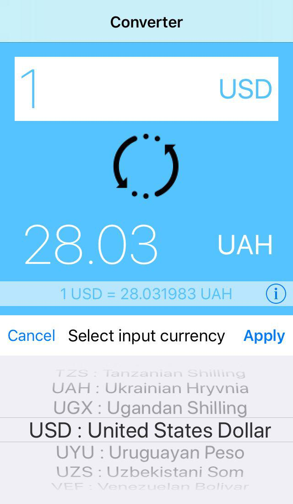

# CurrencyConverter-iOS

Simple app that convert currencies, structured according to the architectural design pattern VIPER.

This app contains the implementation of network requests using Alamofire + RxSwift.
Also used custom logger to print network requests.

  

